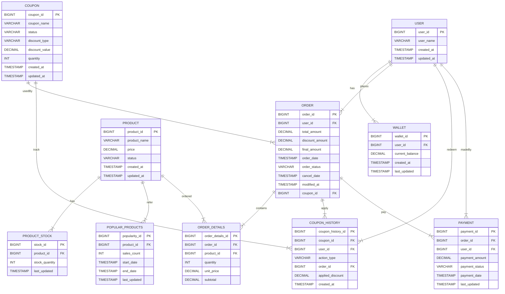

```mermaid
erDiagram
%% -------------------------------------------------------
%% Table: USER
%% -------------------------------------------------------
USER {
BIGINT user_id PK
VARCHAR user_name
TIMESTAMP created_at
TIMESTAMP updated_at
}


%% -------------------------------------------------------
%% Table: WALLET
%% -------------------------------------------------------
WALLET {
BIGINT wallet_id PK
BIGINT user_id FK
DECIMAL current_balance
TIMESTAMP created_at
TIMESTAMP last_updated
}
%% USER (1) -- WALLET (1) or (N) ?
USER ||--|{ WALLET : "has"

%% -------------------------------------------------------
%% Table: PRODUCT
%% -------------------------------------------------------
PRODUCT {
BIGINT product_id PK
VARCHAR product_name
DECIMAL price
VARCHAR status
TIMESTAMP created_at
TIMESTAMP updated_at
}

%% -------------------------------------------------------
%% Table: PRODUCT_STOCK
%% -------------------------------------------------------
PRODUCT_STOCK {
BIGINT stock_id PK
BIGINT product_id FK
INT stock_quantity
TIMESTAMP last_updated
}
%% PRODUCT (1) -- PRODUCT_STOCK (1) or (N) ?
PRODUCT ||--|{ PRODUCT_STOCK : "has"

%% -------------------------------------------------------
%% Table: POPULAR_PRODUCTS
%% -------------------------------------------------------
POPULAR_PRODUCTS {
BIGINT popularity_id PK
BIGINT product_id FK
INT sales_count
TIMESTAMP start_date
TIMESTAMP end_date
TIMESTAMP last_updated
}
%% PRODUCT (1) -- POPULAR_PRODUCTS (N)
PRODUCT ||--|{ POPULAR_PRODUCTS : "refer"

%% -------------------------------------------------------
%% Table: ORDER
%% -------------------------------------------------------
ORDER {
BIGINT order_id PK
BIGINT user_id FK
DECIMAL total_amount
DECIMAL discount_amount
DECIMAL final_amount
TIMESTAMP order_date
VARCHAR order_status
TIMESTAMP cancel_date
TIMESTAMP modified_at
BIGINT coupon_id FK
}
%% USER (1) -- ORDER (N)
USER ||--|{ ORDER : "places"
%% COUPON (1) -- ORDER (N) ? (optional coupon usage)
%% 관계는 아래 COUPON 선언 뒤에

%% -------------------------------------------------------
%% Table: ORDER_DETAILS
%% -------------------------------------------------------
ORDER_DETAILS {
BIGINT order_details_id PK
BIGINT order_id FK
BIGINT product_id FK
INT quantity
DECIMAL unit_price
DECIMAL subtotal
}
%% ORDER (1) -- ORDER_DETAILS (N)
ORDER ||--|{ ORDER_DETAILS : "contains"
%% PRODUCT (1) -- ORDER_DETAILS (N)
PRODUCT ||--|{ ORDER_DETAILS : "ordered"

%% -------------------------------------------------------
%% Table: COUPON
%% -------------------------------------------------------
COUPON {
BIGINT coupon_id PK
VARCHAR coupon_name
VARCHAR status
VARCHAR discount_type
DECIMAL discount_value
INT quantity
TIMESTAMP created_at
TIMESTAMP updated_at
}
%% COUPON (1) -- ORDER (N) ? => optional usage
COUPON ||--|{ ORDER : "usedBy"

%% -------------------------------------------------------
%% Table: COUPON_HISTORY
%% -------------------------------------------------------
COUPON_HISTORY {
BIGINT coupon_history_id PK
BIGINT coupon_id FK
BIGINT user_id FK
VARCHAR action_type
BIGINT order_id FK
DECIMAL applied_discount
TIMESTAMP created_at
}
%% COUPON (1) -- COUPON_HISTORY (N)
COUPON ||--|{ COUPON_HISTORY : "track"
%% USER (1) -- COUPON_HISTORY (N)
USER ||--|{ COUPON_HISTORY : "redeem"
%% ORDER (1) -- COUPON_HISTORY (N) ? => optional if coupon used in order
ORDER ||--|{ COUPON_HISTORY : "apply"

%% -------------------------------------------------------
%% Table: PAYMENT
%% -------------------------------------------------------
PAYMENT {
BIGINT payment_id PK
BIGINT order_id FK
BIGINT user_id FK
DECIMAL payment_amount
VARCHAR payment_status
TIMESTAMP payment_date
TIMESTAMP last_updated
}
%% ORDER (1) -- PAYMENT (N) ? => typically 1:1 or 1:N depends on design
ORDER ||--|{ PAYMENT : "pay"
%% USER (1) -- PAYMENT (N)
USER ||--|{ PAYMENT : "madeBy"
```