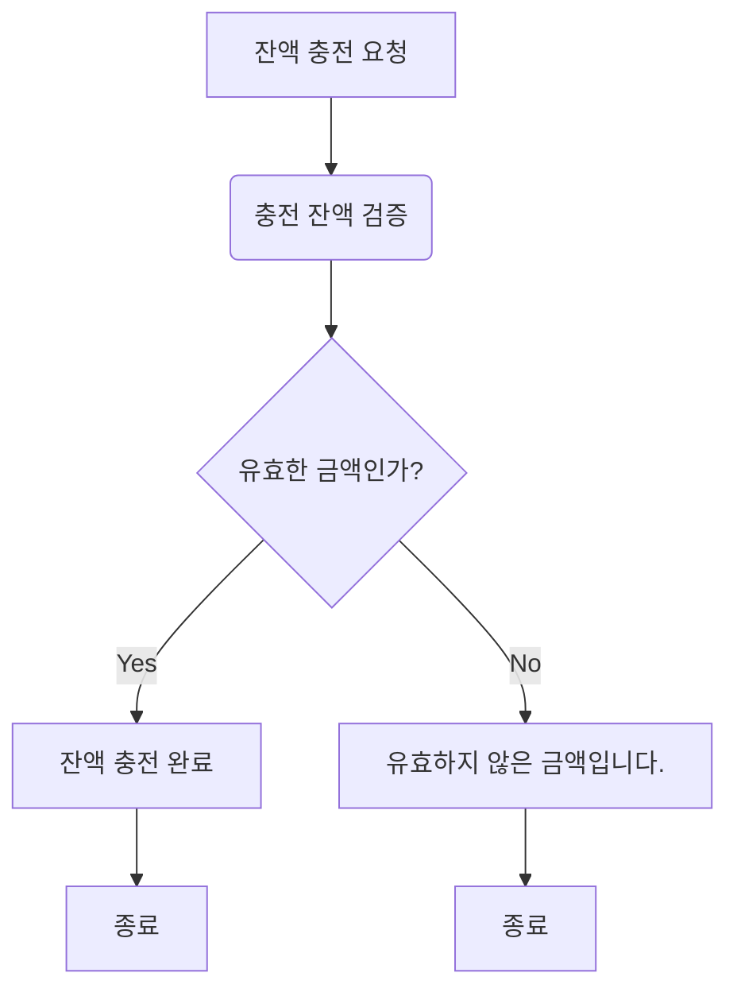
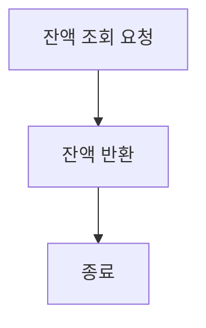
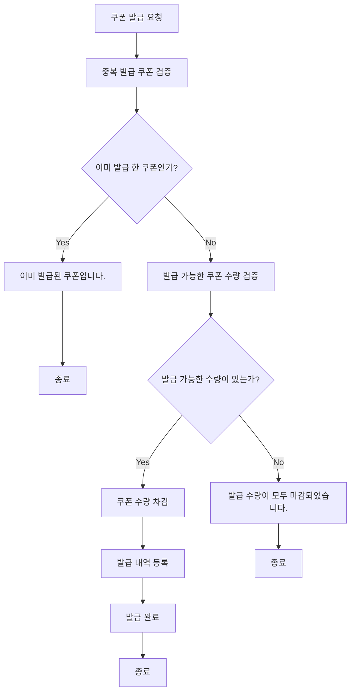
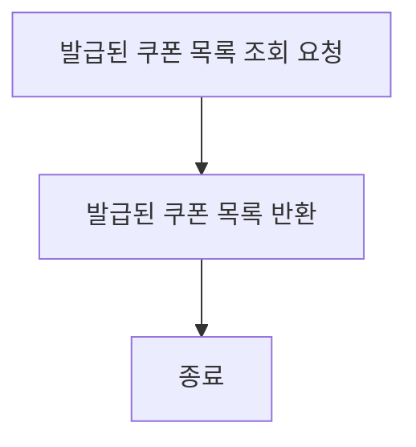
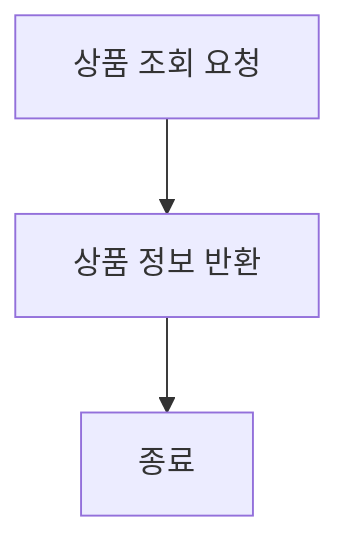
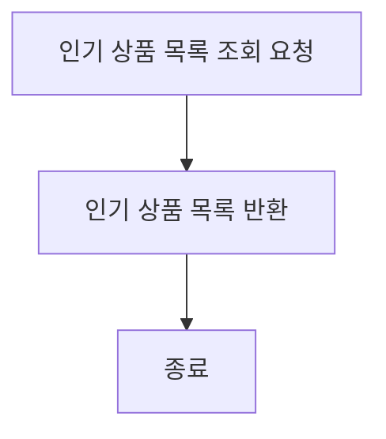
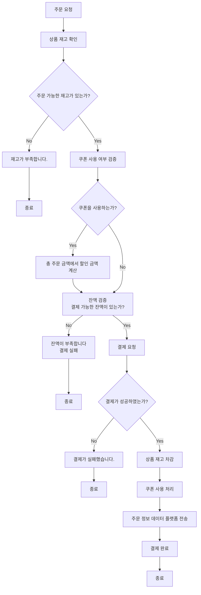

# Flow Chart

============

## 잔액 충전

```mermaid
flowchart TB
A[잔액 충전 요청] --> B(충전 잔액 검증)
B --> C{유효한 금액인가?}
C -- Yes --> D[잔액 충전 완료]
D --> E[종료]
C -- No --> F[유효하지 않은 금액입니다.]
F --> G[종료]
```

## 잔액 조회

```mermaid
flowchart TB
    A[잔액 조회 요청] --> B[잔액 반환]
    B --> C[종료]

```
## 쿠폰 발급

```mermaid
flowchart TB
    A[쿠폰 발급 요청] --> B[중복 발급 쿠폰 검증]
    B --> C{이미 발급 한 쿠폰인가?}
    C -- Yes --> D[이미 발급된 쿠폰입니다.]
    D --> E[종료]
    C -- No --> F[발급 가능한 쿠폰 수량 검증]
    F --> G{발급 가능한 수량이 있는가?}
    G -- Yes --> H[쿠폰 수량 차감]
    H --> I[발급 내역 등록]
    I --> J[발급 완료]
    J --> K[종료]
    G -- No --> L[발급 수량이 모두 마감되었습니다.]
    L --> M[종료]

```
## 쿠폰 조회

```mermaid
flowchart TB
    A[발급된 쿠폰 목록 조회 요청] --> B[발급된 쿠폰 목록 반환]
    B --> C[종료]

```
## 상품 조회

```mermaid
flowchart TB
    A[상품 조회 요청] --> B[상품 정보 반환]
    B --> C[종료]

```
## 인기 상품 조회

```mermaid
flowchart TB
    A[인기 상품 목록 조회 요청] --> B[인기 상품 목록 반환]
    B --> C[종료]

```
## 주문 요청

```mermaid
flowchart TB
    A[주문 요청] --> B[상품 재고 확인]
    B --> C{주문 가능한 재고가 있는가?}
    C -- No --> D[재고가 부족합니다.]
    D --> E[종료]
    C -- Yes --> F[쿠폰 사용 여부 검증]
    F --> G{쿠폰을 사용하는가?}
    G -- Yes --> H[총 주문 금액에서 할인 금액 계산]
    H --> I[잔액 검증<br/>결제 가능한 잔액이 있는가?]
    I -- No --> J[잔액이 부족합니다<br/>결제 실패]
    J --> K[종료]
    I -- Yes --> L[결제 요청]
    L --> M{결제가 성공하였는가?}
    M -- No --> N[결제가 실패했습니다.]
    N --> O[종료]
    M -- Yes --> P[상품 재고 차감]
    P --> Q[쿠폰 사용 처리]
    Q --> R[주문 정보 데이터 플랫폼 전송]
    R --> S[결제 완료]
    S --> T[종료]

    G -- No --> I

```