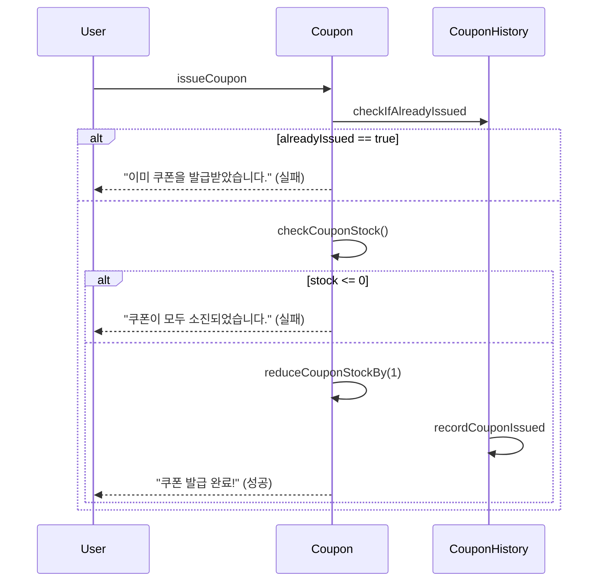
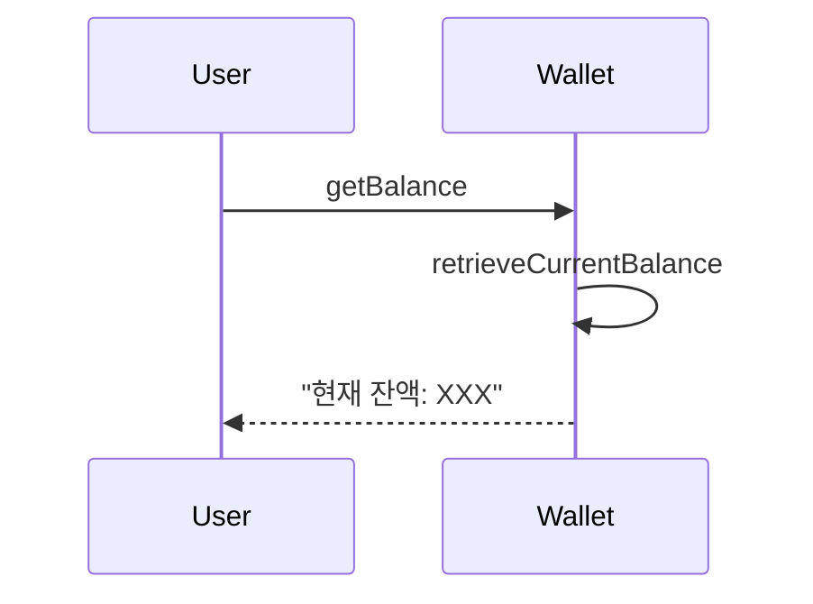
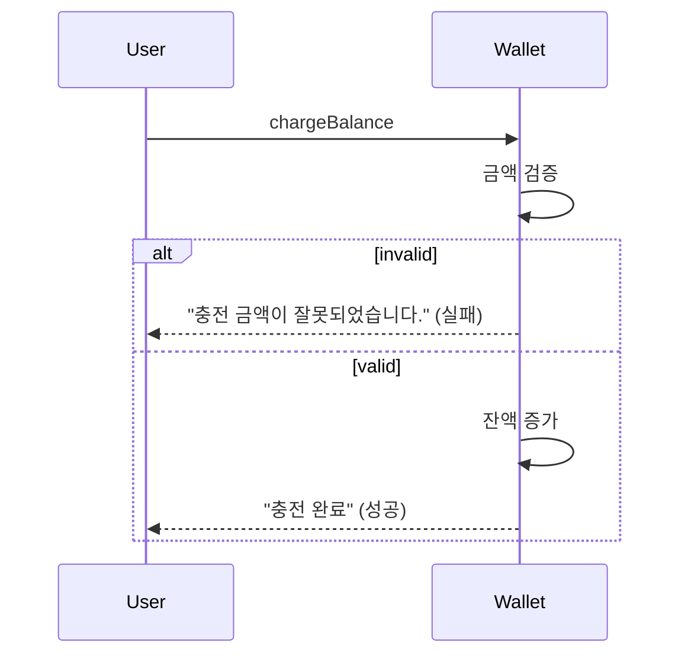
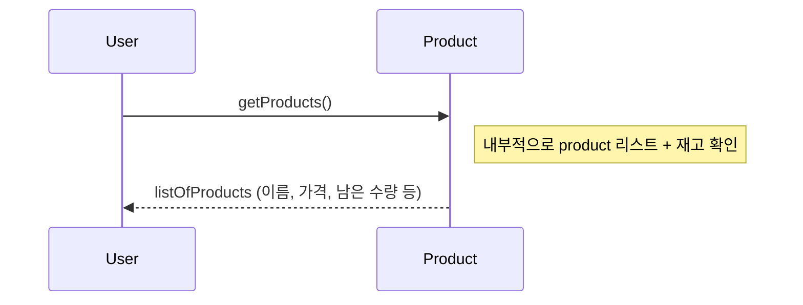
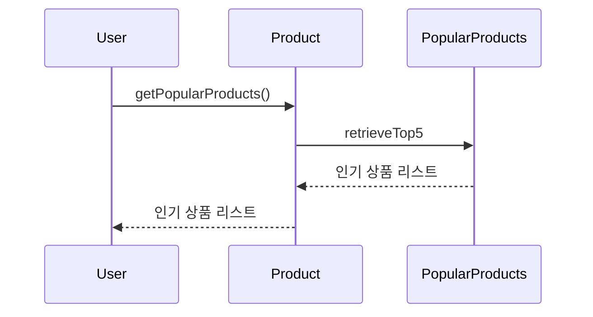
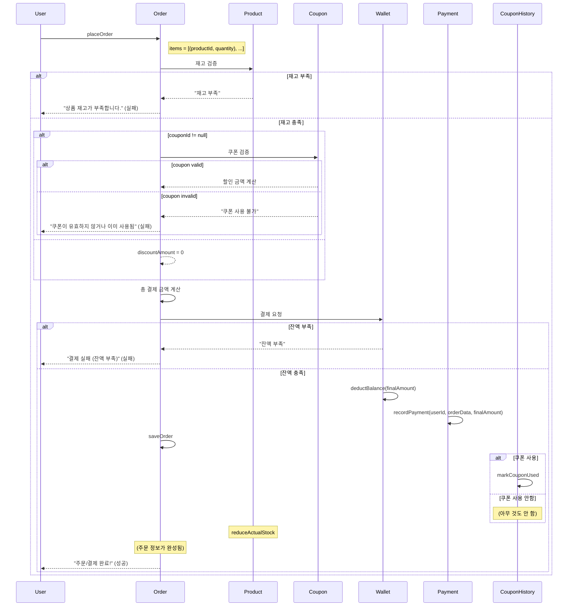

# 시퀀스 다이어그램

=============================

## 쿠폰 발급 API

```mermaid
sequenceDiagram
    participant User
    participant CouponDomain as Coupon
    participant CouponHistoryDomain as CouponHistory 

    User->>CouponDomain: issueCoupon
    CouponDomain->>CouponHistoryDomain: checkIfAlreadyIssued
    alt alreadyIssued == true
        CouponDomain-->>User: "이미 쿠폰을 발급받았습니다." (실패)
    else
        CouponDomain->>CouponDomain: checkCouponStock()
        alt stock <= 0
            CouponDomain-->>User: "쿠폰이 모두 소진되었습니다." (실패)
        else
            CouponDomain->>CouponDomain: reduceCouponStockBy(1) 
            CouponHistoryDomain->>CouponHistoryDomain: recordCouponIssued
            CouponDomain-->>User: "쿠폰 발급 완료!" (성공)
        end
    end
```

## 잔액 조회 API

```mermaid
sequenceDiagram
participant User
participant WalletDomain as Wallet

    User->>WalletDomain: getBalance
    WalletDomain->>WalletDomain: retrieveCurrentBalance
    WalletDomain-->>User: "현재 잔액: XXX"
```

## 잔액 충전 API

```mermaid

sequenceDiagram
participant User
participant WalletDomain as Wallet 

User->>WalletDomain: chargeBalance
WalletDomain->>WalletDomain: 금액 검증
alt invalid
    WalletDomain-->>User: "충전 금액이 잘못되었습니다." (실패)
else valid
    WalletDomain->>WalletDomain: 잔액 증가
    WalletDomain-->>User: "충전 완료" (성공)
end

```

## 상품 조회 API

```mermaid
sequenceDiagram
    participant User
    participant ProductDomain as Product 

    User->>ProductDomain: getProducts()
    Note right of ProductDomain: 내부적으로 product 리스트 + 재고 확인
    ProductDomain-->>User: listOfProducts (이름, 가격, 남은 수량 등)
```

## 인기 상품 조회 API

```mermaid
sequenceDiagram
    participant User
    participant ProductDomain as Product
    participant PopularProductDomain as PopularProducts
    User->>ProductDomain: getPopularProducts()
    ProductDomain->>PopularProductDomain: retrieveTop5
    PopularProductDomain-->>ProductDomain: 인기 상품 리스트
    ProductDomain-->>User: 인기 상품 리스트

```

## 주문/결제 API

```mermaid

sequenceDiagram
    participant User
    participant OrderDomain as Order 
    participant ProductDomain as Product
    participant CouponDomain as Coupon 
    participant WalletDomain as Wallet 
    participant PaymentDomain as Payment 
    participant CouponHistoryDomain as CouponHistory 

    User->>OrderDomain: placeOrder
    Note right of OrderDomain: items = [(productId, quantity), ...]

    OrderDomain->>ProductDomain: 재고 검증
    alt 재고 부족
        ProductDomain-->>OrderDomain: "재고 부족"
        OrderDomain-->>User: "상품 재고가 부족합니다." (실패)
    else 재고 충족
        alt couponId != null
            OrderDomain->>CouponDomain: 쿠폰 검증
            alt coupon valid
                CouponDomain-->>OrderDomain: 할인 금액 계산
            else coupon invalid
                CouponDomain-->>OrderDomain: "쿠폰 사용 불가"
                OrderDomain-->>User: "쿠폰이 유효하지 않거나 이미 사용됨" (실패)
            end
        else
            OrderDomain-->>OrderDomain: discountAmount = 0
        end

        OrderDomain->>OrderDomain: 총 결제 금액 계산

        OrderDomain->>WalletDomain: 결제 요청
        alt 잔액 부족
            WalletDomain-->>OrderDomain: "잔액 부족"
            OrderDomain-->>User: "결제 실패 (잔액 부족)" (실패)
        else 잔액 충족
            WalletDomain->>WalletDomain: deductBalance(finalAmount)
            PaymentDomain->>PaymentDomain: recordPayment(userId, orderData, finalAmount)
            OrderDomain->>OrderDomain: saveOrder

            alt 쿠폰 사용
                CouponHistoryDomain->>CouponHistoryDomain: markCouponUsed
            else 쿠폰 사용 안함
                Note over CouponHistoryDomain: (아무 것도 안 함)
            end

            Note over ProductDomain: reduceActualStock
            Note over OrderDomain: (주문 정보가 완성됨)

            OrderDomain-->>User: "주문/결제 완료!" (성공)
        end
    end

```